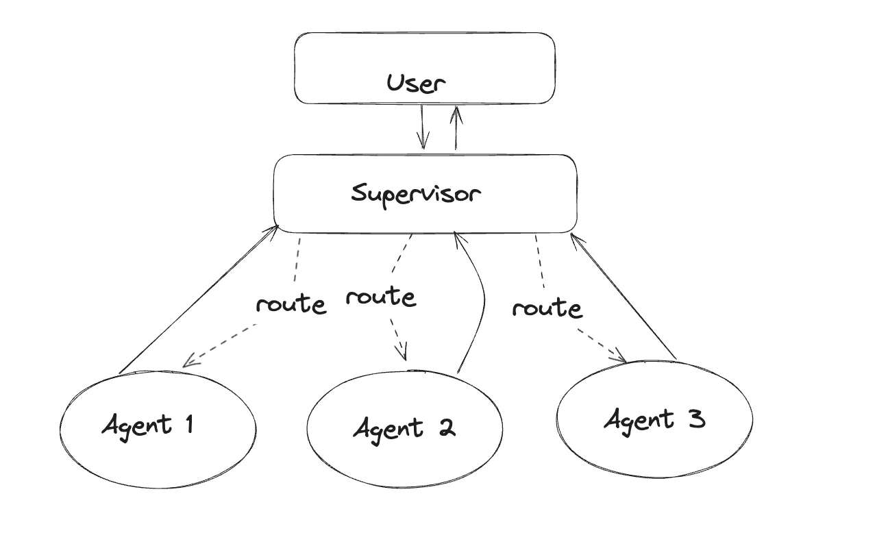

# Newsletter Cron

This newsletter cron app implements multi-agent workflows to send out newsletters to our users. It uses LangGraph to orchestrate the workflows and LangChain to power the agents.

To achieve this, we'll leverage the following technology stack:

LangGraph: The Agentic workflow framework from LangChain
LangChain: Provides neat abstractions for developing LLM-powered applications
*LangSmith: For tracing what our agents are doing under the hood
Modal: To schedule our agents to run at particular time
*Exa AI: Gives our agents the ability to search the web
*Supabase: To store our newsletter HTML template
*Resend: For sending emails at scale

*Be sure to get your API keys from these links. You’ll need them.

## The Cognitive Architecture

*source: [LangGraph Examples GitHub repo](https://github.com/langchain-ai/langgraph/tree/main/examples/multi_agent/img)*

The cognitive we adopt the agent-supervisor architecture to design our agentic workflow. In this architecture, there’s a supervisor agent that’s responsible for delegating tasks to the right agent for the task at hand.

This workflow is implemented in the [graph.py](./graph.py) file.

## Defining the Tools

At their very core, agents are simply Large Language Models running in a loop? And so they’re limited in what they can do based on their training data. Enter tools.

Tools are a way in which we empower our agents to interact with the world. In our case, we’ve seen that we have agents that need the ability to search the web, read html documents from a database, and send emails.

Since LLMs don’t come with these abilities, we need to define them so our agents can use them as needed.

Here's a list of tools we've defined for our agents to use:

- [Search](./tools/search.py): A tool that allows an agent to search the web for information.
- [Load_html_template](./tools/html_loader.py): A tool that allows an agent to read data from a database.
- [Mail](./tools/mail.py): A tool that allows an agent to send an email.

## Deployment

Once we’ve defined our multi-agent application we need a way to deploy it to a serverless platform, so we can run our agents as a cron job that will carry out research on a given topic every week, and send a newsletter to a list of emails.

The serverless platform of choice here is [Modal](https://modal.com/), an infrastructure-as-code service which takes care of all the infrastructure for us, and leaving us to just focus on the code of our application.

To run our app periodically, Modal allows us to schedule functions in a straightforward manner.

In our [main.py](./main.py) file, we define an instance of a `Modal App` , an object representing an application running on Modal.
